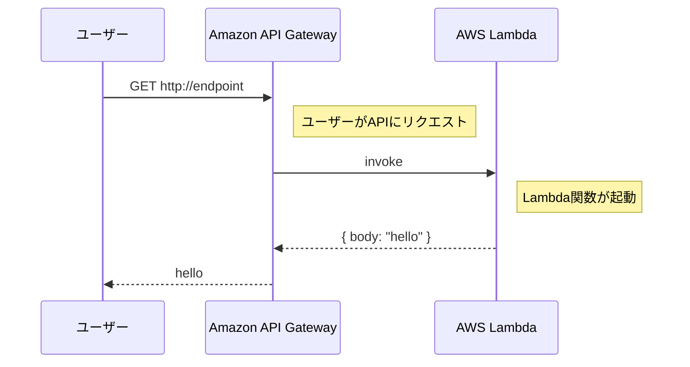

# URL
https://cdkworkshop.com/ja/20-typescript/30-hello-cdk.html

---

# この章で作るもののイメージ



# サンプルコードの削除
- `cdk diff` を実行することで CDK アプリケーションと現在デプロイされているものの違いを確認できる
  - スタックのコンテンツを変更した際に、意図していない変更が発生していないかをデプロイ前に確認できるため便利そう
  - `cdk diff` はあくまで差分確認だけなので、 `cdk deploy` を実行して実際に変更を反映させる必要がある

# Hello Lambda
- AWS Lambda 関数を定義する場合、AWS Lambda の Construct Library を使用する必要がある

> AWS Construct Library: AWS CDK に付属しているコンストラクトのための広範なライブラリ。AWS のサービスごとに独立したモジュールとして提供されている。

```js
// lambda/hello.js

// 「Hello, CDK! You’ve hit [url path]」 というテキストを返す
exports.handler = async function(event) {
  console.log("request:", JSON.stringify(event, undefined, 2));
  return {
    statusCode: 200,
    headers: { "Content-Type": "text/plain" },
    body: `Hello, CDK! You've hit ${event.path}\n`
  };
};
```

```ts
// lib/cdk-workshop-stack.ts
import { Duration, Stack, StackProps } from 'aws-cdk-lib';
import * as lambda from 'aws-cdk-lib/aws-lambda';
import { Construct } from 'constructs';

export class CdkWorkshopStack extends Stack {
  constructor(scope: Construct, id: string, props?: StackProps) {
    super(scope, id, props);

    // Lambda 関数をスタックに追加
    const hello = new lambda.Function(this, 'HelloHandler', {
      // Lambda のランタイムを指定
      runtime: lambda.Runtime.NODEJS_18_X,
      // ハンドラーのコードのパス(cdk コマンドを実行する場所からの相対パス)を指定
      // 例: ハンドラーを lambda ディレクトリ配下においている場合
      code: lambda.Code.fromAsset('lambda'),
      // <ハンドラーのファイル名.ハンドラーの関数名>
      // 例: ハンドラーのファイル名が hello.js、ハンドラーの関数名が handler の場合
      handler: 'hello.handler',
    });
  }
}
```

## クラウドコンポーネントのコンストラクターについて
- CDK の多くのクラスには、シグネチャ (scope, id, props) が含まれており、これがCDK アプリケーションの基本的な構成要素である(= クラウドコンポーネント)
- スコープにはコンストラクトを含めることができ、そのコンストラクトには他のコンストラクトなどを含めることができる

### scope
- この構成が作成されるスコープ
  - ほとんどすべての場合、現在 のコンストラクトスコープ内でコンストラクトを定義することになるため、this を渡すことが多い

### id
- 同じスコープ内のコンストラクト間で一意である必要があるID
- CDK はこれを使用して、各リソースの CloudFormation の論理IDを計算する

### props
- 各コンストラクト固有の初期化プロパティのセット
- 例: lambda.Function コンストラクトは runtime、code、handler を受け入れる

# CDK Watch
## ホットスワップデプロイ
- Lambda関数のコードだけをいじって反映させるために、`cdk deploy` を実行すると、CloudFormationスタックも更新されて時間がかかってしまう
- `cdk deploy --hotswap`を実行することで、ホットスワップデプロイができる
  - CloudFormation デプロイの代わりにホットスワップデプロイを実行できるかどうかを評価して可能なら、CDK CLI は AWS サービス API を使用して直接変更を行う
  - ホットスワップデプロイができない場合は、CloudFormation の完全なデプロイの実行にフォールバックする
  - CloudFormation スタックにドリフトを意図的に発生させるため、実稼働環境での使用は非推奨

## CDK Watch
- `cdk watch` を実行することで、コードとアセットに変更がないか監視し、変更が検出されると自動的にデプロイを試みます。
  - デフォルトでは、ホットスワップでのデプロイを試みる
  - `cdk watch --no-hotswap` を呼び出すと、ホットスワップ動作が無効になる
  - `cdk.json` の `watch` の設定によって、監視対象のコードとアセットが決定される

```json
// cdk.json
{
  "app": "npx ts-node --prefer-ts-exts bin/cdk-workshop.ts",
  "watch": {
    // 監視対象のファイルパスを cdk.json からの相対パスで書く
    "include": [
      "**"
    ],
    // 監視対象外のファイルパスを cdk.json からの相対パスで書く
    "exclude": [
      "README.md",
      "cdk*.json",
      "**/*.d.ts",
      "tsconfig.json",
      "package*.json",
      "yarn.lock",
      "node_modules",
      "test"
    ]
  },
  "context": {
    // 
  }
}
```


# API Gateway
- aws-cdk-lib/aws-apigateway ライブラリの `LambdaRestApi` を使うことで、Lambdaプロキシ統合(=任意のURLパスへのリクエストはすべてLambda関数に直接プロキシされ、関数からの応答がユーザに返される) を使用できる

```ts
// lib/cdk-workshop-stack.ts
import { Duration, Stack, StackProps } from 'aws-cdk-lib';
import * as lambda from 'aws-cdk-lib/aws-lambda';
import * as apigw from 'aws-cdk-lib/aws-apigateway';
import { Construct } from 'constructs';

export class CdkWorkshopStack extends Stack {
  constructor(scope: Construct, id: string, props?: StackProps) {
    super(scope, id, props);

    // Lambda 関数をスタックに追加
    const hello = new lambda.Function(this, 'HelloHandler', {
      // Lambda のランタイムを指定
      runtime: lambda.Runtime.NODEJS_18_X,
      // ハンドラーのコードのパス(cdk コマンドを実行する場所からの相対パス)を指定
      // 例: ハンドラーを lambda ディレクトリ配下においている場合
      code: lambda.Code.fromAsset('lambda'),
      // <ハンドラーのファイル名.ハンドラーの関数名>
      // 例: ハンドラーのファイル名が hello.js、ハンドラーの関数名が handler の場合
      handler: 'hello.handler',
    });

    // Lambda関数お前にAPI Gateway を追加
    new apigw.LambdaRestApi(this, 'Endpoint', {
      handler: hello
    });
  }
}
```