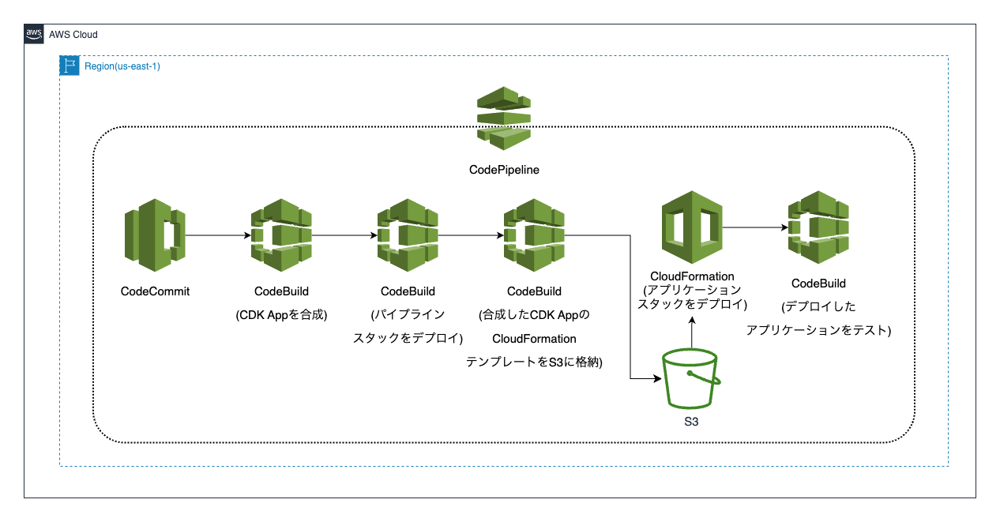

# CDK ワークショップ（TypeScript）

docs ディレクトリの配下に各章のメモを配置しています。

## OverView

### アプリケーションスタック


### パイプライン


## Environment

```shell
❯ aws --version
aws-cli/2.13.32 Python/3.11.6 Darwin/23.1.0 exe/x86_64 prompt/off

❯ node --version
v20.9.0
```

## Usage

1. `AdministratorAccess` のIAMポリシーをアタッチされたIAMユーザを作成し、そのユーザのアクセスキーIDとシークレットアクセスキーを取得する

2. `aws configure` で 取得したアクセスキーIDとシークレットアクセスキーを設定する

3. 下記コマンドを実行して、パイプラインをデプロイする

```shell
npm install
npm run cdk bootstrap
npm run cdk deploy
```

4. デプロイされたCodeCommitのリポジトリURLを確認して、下記のコマンドを実行する

```shell
git remote add codecommit <CodeCommitのリポジトリURL>
```

5. 下記コマンドを実行して、パイプライン経由でアプリケーションスタックをデプロイする

```shell
git push codecommit
```

6. 下記コマンドを実行して、パイプラインを削除する

```shell
npm run cdk destroy
```

> パイプライン以外は、 AWS CloudFormation コンソールから手動で削除する