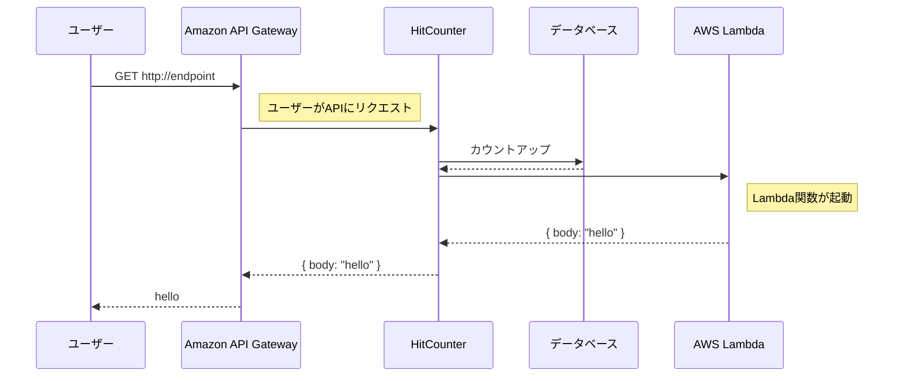

# URL
https://cdkworkshop.com/ja/20-typescript/40-hit-counter.html

---

# この章で作るもののイメージ



# HitCounter API の定義
- 独自のコンストラクトを書いたファイルは、lib配下に置く
- 独自のコンストラクトは、Constructを継承する

# HitCounter ハンドラー

```js
// lambda/hitcounter.mjs
import { DynamoDBClient, UpdateItemCommand } from "@aws-sdk/client-dynamodb";
import { LambdaClient, InvokeCommand } from "@aws-sdk/client-lambda";

const dynamodb = new DynamoDBClient();
const lambda = new LambdaClient();

export const handler =  async function(event) {
  console.log("request:", JSON.stringify(event, undefined, 2));

  // https://docs.aws.amazon.com/AWSJavaScriptSDK/v3/latest/clients/client-dynamodb/classes/updateitemcommand.html
  const upodateCommand = new UpdateItemCommand({
    // データストアとして使用するDynamoDBのテーブル名を環境変数から取得
    TableName: process.env.HITS_TABLE_NAME,
    Key: { path: { S: event.path } },
    UpdateExpression: 'ADD hits \:incr',
    ExpressionAttributeValues: { '\:incr': { N: '1' } }
  });

  await dynamodb.send(upodateCommand);

  // https://docs.aws.amazon.com/AWSJavaScriptSDK/v3/latest/clients/client-lambda/classes/invokecommand.html
  const invokeCommand = new InvokeCommand({
    // ダウンストリームのLambda関数の名前を環境変数から取得
    FunctionName: process.env.DOWNSTREAM_FUNCTION_NAME,
    Payload: JSON.stringify(event)
  });

  const { Payload } = await lambda.send(invokeCommand);
  const result = Buffer.from(Payload).toString();
  console.log('downstream response:', JSON.stringify(result, undefined, 2));

  return JSON.parse(result);
};
```

# リソースの定義

```ts
// lib/hitcounter.ts
import * as lambda from 'aws-cdk-lib/aws-lambda';
import * as dynamodb from 'aws-cdk-lib/aws-dynamodb';
import { Construct } from 'constructs';

export interface HitCounterProps {
  downstream: lambda.IFunction;
}

export class HitCounter extends Construct {
  public readonly handler: lambda.Function;

  constructor(scope: Construct, id: string, props: HitCounterProps) {
    super(scope, id);

    const table = new dynamodb.Table(this, 'Hits', {    
        // DynamoDBテーブルにはパーティションキーが必ず必要
        partitionKey: { name: 'path', type: dynamodb.AttributeType.STRING }
    });

    this.handler = new lambda.Function(this, 'HitCounterHandler', {
        runtime: lambda.Runtime.NODEJS_18_X,
        handler: 'hitcounter.handler',
        code: lambda.Code.fromAsset('lambda'),
        // Lambda関数(lambda/hitcounter.js) の環境変数をリソースの function_name と table_name に紐付ける
        environment: {
            DOWNSTREAM_FUNCTION_NAME: props.downstream.functionName,
            HITS_TABLE_NAME: table.tableName
        }
    });
  }
}
```

# HitCounter の使用

```ts
// lib/cdk-workshop-stack.ts
import { Duration, Stack, StackProps } from 'aws-cdk-lib';
import * as lambda from 'aws-cdk-lib/aws-lambda';
import * as apigw from 'aws-cdk-lib/aws-apigateway';
import { Construct } from 'constructs';
import { HitCounter } from './hitcounter';

export class CdkWorkshopStack extends Stack {
  constructor(scope: Construct, id: string, props?: StackProps) {
    super(scope, id, props);

    const hello = new lambda.Function(this, 'HelloHandler', {
      runtime: lambda.Runtime.NODEJS_18_X,
      code: lambda.Code.fromAsset('lambda'),
      handler: 'hello.handler',
    });

    const helloWithCounter = new HitCounter(this, 'HelloHitCounter', {
      downstream: hello
    });

    new apigw.LambdaRestApi(this, 'Endpoint', {
      handler: helloWithCounter.handler
    });
  }
}
```

# CloudWatch ログ
- 当該Lambda関数のモニタリングからCloudWatchログが確認できる

# アクセス権限の付与
- `dynamoDb インスタンスの grantReadWriteData()` を使うことで、引数に対して DynamoDB の読み書き権限を付与できる
- `lamda インスタンスの grantInvoke()` を使うことで、引数に対して Lambda関数の実行権限を付与できる

# HitCounter のテスト
- [DynamoDB コンソール](https://us-east-1.console.aws.amazon.com/dynamodbv2/home?region=us-east-1#item-explorer) を使うことで、DynamoDB内に書き込まれたデータを確認できる

# 補足
- Lambda関数のランタイムとして nodejs 18系を使用しているため hitcounter.js のコードを一部改変した。
  - 詳細は https://zenn.dev/8rine23/scraps/3c6b6cd96bf3f6