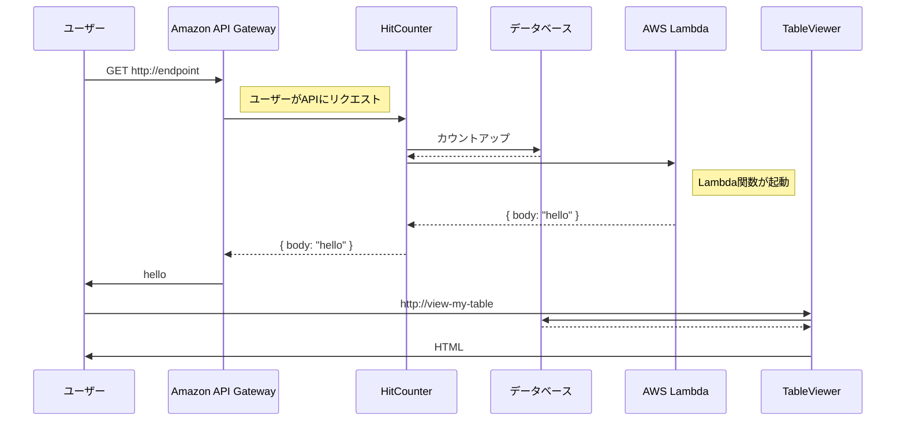

# URL
https://cdkworkshop.com/ja/20-typescript/50-table-viewer.html

---

# この章で作るもののイメージ



# Table Viewer コンストラクト
- `cdk-dynamo-table-viewer` というコンストラクトライブラリを使って、HitCounterテーブルの中身を見れるようにする

> https://www.npmjs.com/package/cdk-dynamo-table-viewer

# ライブラリのインストール
- npm モジュール形式でコンストラクトライブラリが用意されている場合は、`npm run watch` コマンドを停止してから `npm install` を行う必要がある(Windows限定)

# アプリに table Viewer を追加
- 自作したコンストラクト(HitCounter)と同じような感じで、`lib/cdk-workshop-stack.ts` に書く

```ts
// 省略
import { TableViewer } from 'cdk-dynamo-table-viewer';

export class CdkWorkShopStack extends Stack{
  constructor(scope: Construct, id: string, props?: StackProps) {
    // 省略

    // 自作したコンストラクト(HitCounter)
    const helloWithCounter = new HitCounter(this, 'HelloHitCounter',{
      downstream: // 省略
    });

    // 省略

    // 第三者が作成したコンストラクト(cdk-dynamo-table-viewer)
    new TableViewer(this, 'ViewHitCounter', {
      title: 'Hello Hits',
      table: helloWithCounter.table,
    });
  }
}
```

# HitCounter テーブルを公開
- あるコンストラクトで作成したAWSリソースを他のコンストラクトで使用したい場合は、一工夫が必要

> 例: HitCounter で作成した DynamoDB を TableViewer で使えるようにする

```ts
// lib/hitcounter.ts
// 省略

export class HitCounter extends Construct {
  // 省略

  // パブリックプロパティとして、作成した DynamoDB を公開することで HitCounter の外から利用できるようにする
  public readonly table: dynamodb.Table;

  constructor(scope: Construct, id: string, props: HitCounterProps) {
    super(scope, id);

    // DynamoDB を作成
    const table = new dynamodb.Table(this, 'Hits', {
        partitionKey: { name: 'path', type: dynamodb.AttributeType.STRING }
    });
    // 作成した DynamoDB をパブリックプロパティに入れて公開
    this.table = table;

    // 省略
  }
}

// lib/cdk-workshop-stack.ts
// 省略
import { TableViewer } from 'cdk-dynamo-table-viewer';

export class CdkWorkShopStack extends Stack{
  constructor(scope: Construct, id: string, props?: StackProps) {
    // 省略

    const helloWithCounter = new HitCounter(this, 'HelloHitCounter',{
      downstream: // 省略
    });

    // 省略

    new TableViewer(this, 'ViewHitCounter', {
      title: 'Hello Hits',
      // HitCounter 内で作った DynamoDB をパブリックプロパティ経由で利用
      table: helloWithCounter.table,
    });
  }
}
```

# アプリのデプロイ
- コンストラクトライブラリを使用する際には、セキュリティリスクがないか(例: 不必要に強力なIAM権限が付与されていないか、データを外部に公開されていないか) を `cdk diff` で確認した上で実行することが重要
- 利用したコンストラクトがアプリケーションに与える影響を理解するのはユーザの責任であるため、コンストラクトライブラリが信頼できる提供者から提供されていることを必ず確認すること

# 追加課題
Q. テーブルのアクセス数順にソートするにはどうしたらいいか？

A. TableViewer コンストラクトの sortByに 「-hits」 を指定する

```ts
const viewer = new TableViewer(this, 'CookiesViewer', {
  table: cookiesTable,
  title: 'Cookie Sales', // タイトル名
  sortBy: '-sales'       // どれを見てソートするか ("-" をつけたら降順)
});
```
https://www.npmjs.com/package/cdk-dynamo-table-viewer#usage-typescriptjavascript